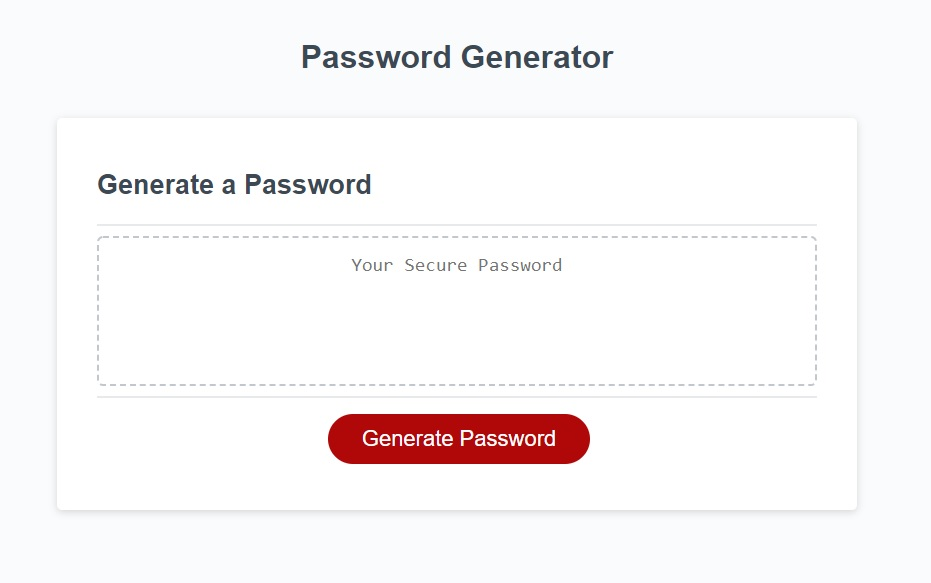

# PasswordGenerator

This project generates a random password with the user requirements.

The following options are available:

1. __Lowercase__
1. __Uppercase__
1. __Numeric__
1. __Special characters__

The user needs to click on Generate Password, after that a series of questions will follow asking the user to specify the lenght and what options does he want.

The password must be between 8 and 128 characters.

The Password Generator can be accessed here: https://mariodiosdado.github.io/PasswordGenerator/

